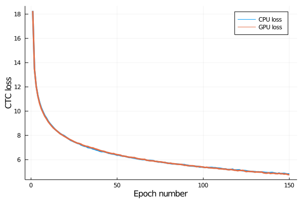
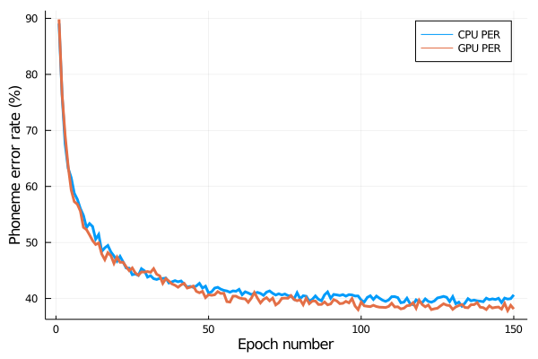

# flux-ctc-grad

First, install the appropriate Julia packages:

```
julia -e "using Pkg; Pkg.activate(\".\"); Pkg.instantiate()"
```

To download the data, extract it, and convert it to text form for the Python version:

```bash
julia --project=. 00-data.jl
```

To run the network using the CPU implementation of CTC:

```bash
julia --project=. 01-cpu-model.jl
```

To run the network with the GPU implementation of CTC:

```bash
julia --project=. 02-gpu-model.jl
```

The network is being trained on a subset of the production data from the Massive Auditory Lexical Decision database (Tucker et al., 2019). The subset can be found [here], but the data script will automatically download and decompress the data for you. The subset consists of a random sampling of 10,000 English words taken from the auditory stimuli. This data set was chosen over the TIMIT set because TIMIT is not free of charge, so users may have a hard time replicating these networks if they do not have university or private company affiliation.

The training loss and validation phoneme error rate are visualized below.





The lowest validation phoneme error rate was achieved after epoch 133 for the network trained with the CPU implementation and after epoch 148 for the network trained with the GPU implementation. These results are presented in the table below.

Implementation version	| Epochs neeed	| PER	| Loss
------------------------|---------------|-------|-------
CPU						| 133			| 38.63	| 4.97
GPU						| 148			| 37.84	| 4.82

It is difficult to situate these results exactly because this data set has not been put through the intense benchmarking process that the TIMIT data set has been put through. Graves et al. (2006) and Graves (2012) report a phoneme error rate of around 30% on the TIMIT data set with a very similar network architecture. Given that the data set being used for the networks presented here is smaller than TIMIT, the network performance here seems reasonable.

## References

Graves, A., Fernández, S., Gomez, F., & Schmidhuber, J. (2006, June). Connectionist temporal classification: labelling unsegmented sequence data with recurrent neural networks. In *Proceedings of the 23rd International Conference on Machine learning* (pp. 369-376).

Graves, A. (2012). *Supervised sequence labelling with recurrent neural networks*. Springer.

Tucker, B. V., Brenner, D., Danielson, D. K., Kelley, M. C., Nenadić, F., & Sims, M. (2019). The massive auditory lexical decision (MALD) database. *Behavior research methods, 51*(3), 1187-1204.