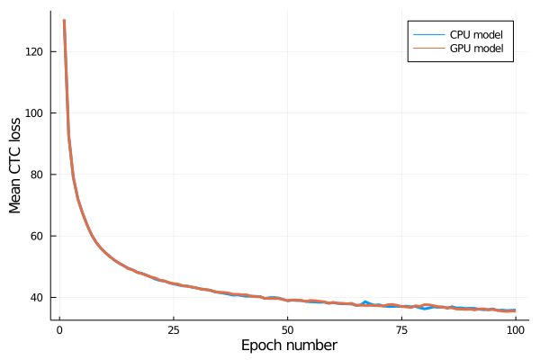
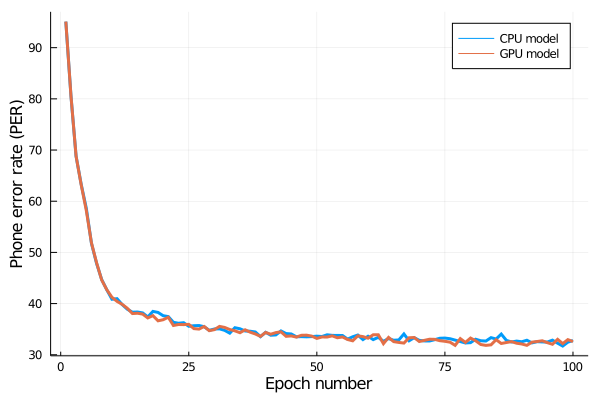

# flux-ctc-grad

First, install the appropriate Julia packages:

```
julia -e "using Pkg; Pkg.activate(\".\"); Pkg.instantiate()"
```

To download the data, extract it, and convert it to text form for the Python version:

```bash
julia --project=. 00-data.jl
```

To run the network using the CPU implementation of CTC:

```bash
julia --project=. 01-cpu-model.jl
```

To run the network with the GPU implementation of CTC:

```bash
julia --project=. 02-gpu-model.jl
```

The network is being trained on the TIMIT speech corpus, using the configurations and training procedures outlined in Graves's (2012) phoneme recognition CTC network without phoneme label folding (["Phoneme Recognition 1"](https://www.cs.toronto.edu/~graves/preprint.pdf)). The decoding technique was "best path decoding," where the output label sequence is taken as the most probable phoneme class at each time step. This output is then processed to remove the duplicate labels and blank labels before the phoneme error rate (PER) is caclculated.

The training loss and validation phoneme error rate are visualized below.





The lowest validation phoneme error rate was achieved after epoch 98 for the network trained with the CPU implementation and after epoch 83 for the network trained with the GPU implementation. These results are presented in the table below.

Implementation version	| Epochs neeed	| PER	| Loss
------------------------|---------------|-------|-------
CPU						| 98			| 31.70	| 35.71
GPU						| 83			| 31.84	| 37.00

Graves (2012) reports a mean PER of 31.47 over 5 runs, with a standard error of 0.21. The PER values from from the two networks reported here are reasonably close to those reported values. It is possible that the small remaining discrepancy has to do with the random sample of the validation data. Overall, I expect the implementation of CTC loss function contained here to be sufficiently similar to the original specification.


## References

Graves, A., Fernández, S., Gomez, F., & Schmidhuber, J. (2006, June). Connectionist temporal classification: labelling unsegmented sequence data with recurrent neural networks. In *Proceedings of the 23rd International Conference on Machine learning* (pp. 369-376).

Graves, A. (2012). *Supervised sequence labelling with recurrent neural networks*. Springer.

Tucker, B. V., Brenner, D., Danielson, D. K., Kelley, M. C., Nenadić, F., & Sims, M. (2019). The massive auditory lexical decision (MALD) database. *Behavior research methods, 51*(3), 1187-1204.