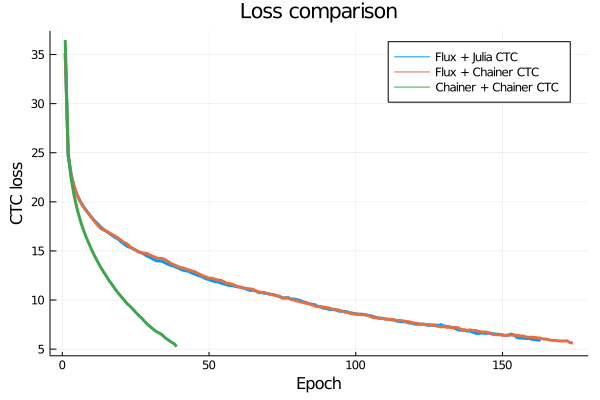
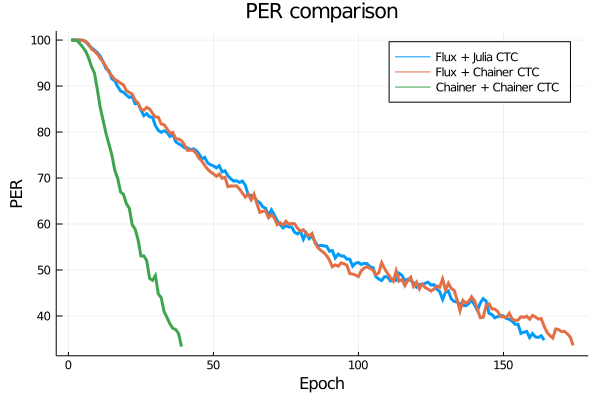

# flux-ctc-grad

To download the data, extract it, and convert it to text form for the Python version:

```julia
julia 00-data.jl
```

To run the network with the Julia code for the ctc loss and gradients:

```bash
julia 01-model.jl
```

To run the network using the Chainer code for the ctc loss and gradients:

```bash
julia 02-model_ch_grads.jl
```

To run the network in the Chainer framework using its ctc loss and gradients, first make sure the necessary packages are installed:

```bash
pip install chainer numpy tqdm textdistance
```

Then run the network:

```bash
python 03-chainer_model.jl
```

Both the loss and the phoneme error rate (PER) decrease much faster for the network in Chainer using the CTC loss from Chainer as compared to the networks in Flux, for which the loss and PER decreased more slowly. A network was considered to have converged once the phoneme error rate was below 35%, which is just a bit higher than the reported best PER from Graves et al. (2006) and Graves (2012), which is around 30%. It is likely that further training of the networks could bring the loss closer to or lower than that reported lowest PER, but it does not seem particularly relevant to do here.





The number of epochs required for convergence, training PER at convergence, and training loss at convergence are presented in the following table.

Configuration         | Epochs needed | PER   | Loss
----------------------|---------------|-------|--------
Flux + Julia CTC      | 180           | 34.40 | 5.91
Flux + Chainer CTC    | 174           | 33.60 | 5.62
Chainer + Chainer CTC | 45            | 33.63 | 4.92

## References

Graves, A., Fernández, S., Gomez, F., & Schmidhuber, J. (2006, June). Connectionist temporal classification: labelling unsegmented sequence data with recurrent neural networks. In *Proceedings of the 23rd International Conference on Machine learning* (pp. 369-376).

Graves, A. (2012). *Supervised sequence labelling with recurrent neural networks*. Springer.